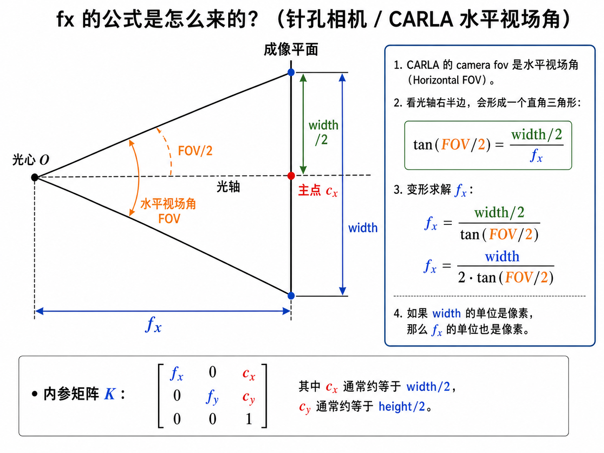
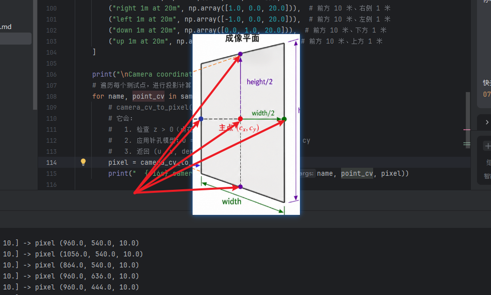
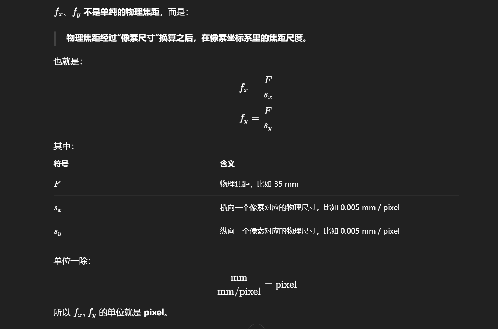

# 05 Depth Camera Debug Draw 原理报告

本文对应同级源码：

```text
05_depth_camera_debug_draw.py
```

它主要解释一件事：

```text
如何通过屏幕像素坐标 + 深度信息，计算物体在 UE/CARLA 世界中的 3D 坐标位置。
```

---

## 1. 核心结论

当你点击屏幕上的一个点时，得到的是图像坐标：

```text
pixel = (u, v)
```

深度相机告诉你这个像素对应的点离相机多远：

```text
depth = z
```

然后用相机内参 `K` 把：

```text
(u, v, depth)
```

还原成相机坐标系里的 3D 点，再用相机外参 `T` 把这个点从相机坐标系转换到 UE/CARLA 世界坐标系。

整体链路是：

```text
屏幕像素 (u, v)
  + depth camera 给出的深度 z
  + 相机内参 K
    ↓
OpenCV 相机坐标系下的 3D 点
    ↓
CARLA / UE 相机局部坐标
    ↓
相机外参 camera transform
    ↓
UE / CARLA 世界坐标
```

在代码里，对应核心调用是：

```python
clicked_depth = float(depth_camera.latest_depth_m[v, u])

clicked_world = pixel_depth_to_world(
    u,
    v,
    clicked_depth,
    rgb_camera.get_transform(),
    k
)
```

---

## 2. 屏幕坐标是什么

在 pygame 图像里，鼠标点击得到：

```python
clicked_pixel = event.pos
u, v = clicked_pixel
```

其中：

```text
u：图像横坐标，向右增大
v：图像纵坐标，向下增大
```

图像左上角是：

```text
(0, 0)
```

如果窗口是 `1280 x 720`，图像中心大概是：

```text
(640, 360)
```

注意，numpy 读图像时索引顺序是：

```python
image[row, col]
```

也就是：

```python
image[v, u]
```

所以代码里读取深度时写的是：

```python
clicked_depth = float(depth_camera.latest_depth_m[v, u])
```

而不是：

```python
depth_camera.latest_depth_m[u, v]
```

---

## 3. 深度图是什么

CARLA 的 depth camera 给出的不是普通 RGB 颜色，而是把深度编码在图像的 RGB 三个通道里。

在 `common.py` 中，深度解码逻辑是：

```python
normalized = (r + g * 256 + b * 256 * 256) / (256 ** 3 - 1)
depth_m = 1000 * normalized
```

意思是：

```text
RGB 三个 8-bit 通道合起来表示一个 24-bit 深度值；
再把它归一化到 [0, 1]；
最后乘以 1000，得到米。
```

所以点击某个像素后，你能得到：

```text
这个像素对应的物体，大约离相机 depth 米。
```

例如：

```text
pixel = (700, 520)
depth = 12.3 m
```

含义是：

```text
图像上 (700, 520) 这个方向上的物体距离相机约 12.3 米。
```

---

## 4. 相机内参 K 是什么

相机内参 `K` 描述的是：

```text
一个 3D 点在相机前方时，会投影到图像的哪个像素上。
```

矩阵形式是：

```text
K = [fx,  0, cx]
    [ 0, fy, cy]
    [ 0,  0,  1]
```

其中：

```text
fx / fy：焦距，单位是像素
cx / cy：主点，通常接近图像中心
```

在教程里，窗口是 `1280 x 720`，FOV 是 `90°`，所以大概：

```text
fx = 640
fy = 640
cx = 640
cy = 360
```

直觉上：

```text
cx, cy 是图像中心；
fx, fy 决定“一个空间偏移会变成多少像素偏移”。
```

如果 `fx/fy` 越大，同样的空间偏移会变成更大的像素偏移，画面更像“长焦”。

如果 `fx/fy` 越小，同样的空间偏移在图像上变化更小，画面更像“广角”。



### pic2


### fx和fy

---

## 5. 像素 + 深度如何变成相机坐标

假设一个 3D 点在 OpenCV 相机坐标系里是：

```text
X_camera = (x, y, z)
```

OpenCV 常用相机坐标定义是：

```text
x：向右
y：向下
z：向前
```

针孔相机模型告诉我们：

```text
u = fx * x / z + cx
v = fy * y / z + cy
```

现在我们已知：

```text
u, v, z
```

其中 `z` 就是 depth。

所以可以反过来算：

```text
x = (u - cx) / fx * z
y = (v - cy) / fy * z
z = depth
```

代码里对应：

```python
point_cv = pixel_depth_to_camera_cv(u, v, depth, k)
```

这一步得到的是：

```text
OpenCV 相机坐标系下的 3D 点。
```

例如：

```text
u = 700
v = 520
depth = 12.3
fx = 640
fy = 640
cx = 640
cy = 360
```

则：

```text
x = (700 - 640) / 640 * 12.3 ≈ 1.15 m
y = (520 - 360) / 640 * 12.3 ≈ 3.08 m
z = 12.3 m
```

含义是：

```text
这个点在相机前方 12.3 米；
偏右 1.15 米；
偏下 3.08 米。
```

---

## 6. 2D 到 3D 公式是怎么来的

这一节专门讲：

```text
为什么 x = (u - cx) / fx * depth
为什么 y = (v - cy) / fy * depth
为什么 z = depth
```

你可以把相机想象成一个“小孔相机”：

```text
真实 3D 世界中的点
    ↓ 光线穿过相机光心
成像到 2D 图像平面上
```

相机拍照时，会把一个 3D 点压缩成一个 2D 像素点。

问题是：

```text
3D -> 2D 会丢失深度；
2D -> 3D 必须把深度补回来。
```

也就是说：

```text
单独一个像素点 (u, v) 不能确定唯一 3D 点；
像素点 (u, v) + 深度 depth 才能确定唯一 3D 点。
```

---

### 6.1 相机坐标系先怎么定义

我们先用 OpenCV 常用相机坐标系，因为公式最常见：

```text
          z 前方
          ^
          |
          |
相机光心 O +------> x 右方
         /
        /
       v
      y 下方
```

所以一个相机坐标点：

```text
P_camera = (x, y, z)
```

含义是：

```text
x：点在相机右侧多少米
y：点在相机下方多少米
z：点在相机前方多少米
```

这里的 `z` 就是“沿相机正前方光轴的距离”。

很多深度图给的 depth 就是这个 `z-depth`。

在本教程里，我们先按这个最常见、最容易理解的情况讲。

---

### 6.2 图像坐标系怎么定义

图像上的像素坐标是：

```text
u：横坐标，向右增大
v：纵坐标，向下增大
```

图像中心附近有一个特殊点，叫主点：

```text
(cx, cy)
```

如果图像是 `1280 x 720`，主点通常接近：

```text
cx = 640
cy = 360
```

主点可以理解为：

```text
相机正前方那条光轴打到图像上的位置。
```

所以：

```text
u - cx
```

表示这个像素相对图像中心向右偏了多少像素。

```text
v - cy
```

表示这个像素相对图像中心向下偏了多少像素。

---

### 6.3 焦距 fx / fy 是什么

`fx` 和 `fy` 是焦距，但单位不是米，而是像素。

你可以先粗略理解为：

```text
fx：相机坐标中“横向 1 米 / 前方 1 米”的比例，会在图像上变成多少像素
fy：相机坐标中“竖向 1 米 / 前方 1 米”的比例，会在图像上变成多少像素
```

焦距越大：

```text
同样的空间偏移，在图像上看起来偏得越多
画面更像长焦
```

焦距越小：

```text
同样的空间偏移，在图像上看起来偏得越少
画面更像广角
```

在教程中：

```python
k = build_camera_intrinsic_k(WINDOW_WIDTH, WINDOW_HEIGHT, CAMERA_FOV)
```

对于：

```text
width = 1280
height = 720
fov = 90°
```

大致得到：

```text
fx = 640
fy = 640
cx = 640
cy = 360
```

---

### 6.4 先看 3D 到 2D：为什么要除以 z

针孔相机投影公式是：

```text
u = fx * x / z + cx
v = fy * y / z + cy
```

这里最关键的是：

```text
x / z
y / z
```

为什么要除以 `z`？

因为越远的东西，在图像上看起来越小。

举个直觉例子：

```text
一个点在右侧 1 米、前方 5 米：
  x / z = 1 / 5 = 0.2

一个点在右侧 1 米、前方 20 米：
  x / z = 1 / 20 = 0.05
```

它们横向都偏右 1 米，但远处那个点在图像上偏得更少。

这就是透视效果。

所以：

```text
图像横向偏移 ≈ 横向真实偏移 / 前方距离
图像纵向偏移 ≈ 纵向真实偏移 / 前方距离
```

再乘上焦距像素 `fx/fy`，加上图像中心 `cx/cy`，就得到最终像素：

```text
u = fx * x / z + cx
v = fy * y / z + cy
```

---

### 6.5 再看 2D 到 3D：把公式反过来

现在我们不是要投影，而是要反投影。

我们已经知道：

```text
u = fx * x / z + cx
```

把 `cx` 移到左边：

```text
u - cx = fx * x / z
```

两边除以 `fx`：

```text
(u - cx) / fx = x / z
```

两边乘以 `z`：

```text
x = (u - cx) / fx * z
```

同理：

```text
y = (v - cy) / fy * z
```

如果深度图给出的就是：

```text
z = depth
```

那么：

```text
x = (u - cx) / fx * depth
y = (v - cy) / fy * depth
z = depth
```

这就是代码里的公式。

---

### 6.6 归一化相机平面：更直观的理解

还有一种更形象的理解方式。

先把像素点变成“归一化相机平面”上的点：

```text
x_norm = (u - cx) / fx
y_norm = (v - cy) / fy
```

这个点可以理解为：

```text
当 z = 1 米时，这条像素射线在相机前方 1 米处的位置。
```

也就是说，像素 `(u, v)` 对应一条从相机光心出发的射线：

```text
ray = (x_norm, y_norm, 1)
```

如果真实深度是 `depth`，那就沿这条射线放大到 `z = depth`：

```text
x = x_norm * depth
y = y_norm * depth
z = depth
```

所以完整写法是：

```python
x_norm = (u - cx) / fx
y_norm = (v - cy) / fy

x = x_norm * depth
y = y_norm * depth
z = depth
```

它和前面的公式完全一样，只是拆成了两步：

```text
像素 -> 射线方向
射线方向 + 深度 -> 3D 点
```

---

### 6.7 用一个更完整的数字例子

假设：

```text
图像宽高：1280 x 720
fx = 640
fy = 640
cx = 640
cy = 360
```

你点击：

```text
u = 640
v = 360
depth = 10 m
```

这是图像中心，所以：

```text
x = (640 - 640) / 640 * 10 = 0
y = (360 - 360) / 640 * 10 = 0
z = 10
```

结果：

```text
P_camera = (0, 0, 10)
```

含义：

```text
这个点就在相机正前方 10 米。
```

再看一个偏右、偏下的点：

```text
u = 800
v = 460
depth = 10 m
```

计算：

```text
x = (800 - 640) / 640 * 10 = 2.5
y = (460 - 360) / 640 * 10 = 1.5625
z = 10
```

结果：

```text
P_camera = (2.5, 1.56, 10)
```

含义：

```text
这个点在相机前方 10 米；
在相机右侧 2.5 米；
在相机下方 1.56 米。
```

再看同一个像素，但深度变成 20 米：

```text
u = 800
v = 460
depth = 20 m
```

计算：

```text
x = (800 - 640) / 640 * 20 = 5.0
y = (460 - 360) / 640 * 20 = 3.125
z = 20
```

含义：

```text
同一个像素方向，如果深度更远，对应的真实横向/纵向偏移也更大。
```

这很重要：

```text
远处点的深度误差和像素误差，会被放大成更大的 3D 位置误差。
```

---

### 6.8 代码里到底如何做

在 `common.py` 里，核心函数是：

```python
def pixel_depth_to_camera_cv(u, v, depth_m, k):
    fx = k[0, 0]
    fy = k[1, 1]
    cx = k[0, 2]
    cy = k[1, 2]

    x = (u - cx) / fx * depth_m
    y = (v - cy) / fy * depth_m
    z = depth_m

    return np.array([x, y, z], dtype=float)
```

逐行理解：

```python
fx = k[0, 0]
fy = k[1, 1]
cx = k[0, 2]
cy = k[1, 2]
```

从相机内参矩阵里取出焦距和主点。

```python
x = (u - cx) / fx * depth_m
```

先看像素相对中心向右偏了多少：

```text
u - cx
```

再除以焦距，把“像素偏移”变成“归一化方向”：

```text
(u - cx) / fx
```

最后乘以深度，把方向变成真实米制坐标：

```text
* depth_m
```

`y` 同理：

```python
y = (v - cy) / fy * depth_m
```

最后：

```python
z = depth_m
```

因为 depth 表示相机前方距离。

---

### 6.9 depth 到底是 z-depth 还是 range-depth

这是现实深度相机中非常关键的坑。

刚才公式默认：

```text
depth = z
```

也就是：

```text
depth 是沿相机光轴的前方距离。
```

这种深度叫：

```text
z-depth
```

但有些传感器给的是：

```text
range-depth
```

也就是：

```text
从相机光心到物体点的欧氏距离。
```

两者不同。

如果像素在图像中心附近，它们差不多。

如果像素很靠边，区别会变明显。

### 6.9.1 z-depth 的公式

如果 depth 是 z-depth：

```text
x = x_norm * depth
y = y_norm * depth
z = depth
```

也就是本教程使用的公式。

### 6.9.2 range-depth 的公式

如果 depth 是 range，也就是射线长度，那么要先构造射线：

```text
ray = (x_norm, y_norm, 1)
```

把它归一化：

```text
ray_unit = ray / ||ray||
```

再乘以 range：

```text
P_camera = ray_unit * range
```

伪代码：

```python
x_norm = (u - cx) / fx
y_norm = (v - cy) / fy

ray = np.array([x_norm, y_norm, 1.0])
ray_unit = ray / np.linalg.norm(ray)

point_camera = ray_unit * range_depth
```

所以现实中一定要查清楚你的深度相机 SDK 输出的是：

```text
z-depth
还是
range-depth
```

不然 3D 点会系统性偏差。

---

### 6.10 为什么图像点越远越容易抖

从公式看：

```text
x = (u - cx) / fx * depth
```

如果像素 `u` 有 1 个像素的误差，那么 `x` 的误差大约是：

```text
error_x ≈ 1 / fx * depth
```

假设：

```text
fx = 640
```

如果 depth = 5 米：

```text
error_x ≈ 1 / 640 * 5 = 0.0078 m
```

大约 0.8 厘米。

如果 depth = 50 米：

```text
error_x ≈ 1 / 640 * 50 = 0.078 m
```

大约 7.8 厘米。

这还只是 1 个像素误差。

如果检测点抖 5 个像素，50 米外横向误差可能接近：

```text
0.39 m
```

所以远处 AR 点容易抖，需要：

```text
检测点滤波
3D 点滤波
车辆运动预测
多帧融合
合理限制最大作用距离
```

---

### 6.11 2D 到 3D 的最小实现步骤

如果你以后脱离 CARLA，用真实 RGB-D 相机，最小实现就是：

```python
def pixel_to_3d_camera(u, v, depth, fx, fy, cx, cy):
    x = (u - cx) / fx * depth
    y = (v - cy) / fy * depth
    z = depth
    return x, y, z
```

调用：

```python
u, v = detected_pixel
depth = depth_image[v, u]

x, y, z = pixel_to_3d_camera(u, v, depth, fx, fy, cx, cy)
```

得到：

```text
点在相机坐标系下的位置。
```

如果要转到车体坐标：

```python
P_camera = np.array([x, y, z, 1.0])
P_vehicle = T_camera_to_vehicle @ P_camera
```

如果要转到世界坐标：

```python
P_world = T_vehicle_to_world @ P_vehicle
```

---

### 6.12 这一步常见错误

常见错误 1：把 `u, v` 顺序和图像索引搞反。

```python
depth = depth_image[v, u]  # 正确
depth = depth_image[u, v]  # 常见错误
```

常见错误 2：忘记减主点。

```text
错误：x = u / fx * depth
正确：x = (u - cx) / fx * depth
```

如果忘记减主点，图像中心点也会被算成很大的横向偏移。

常见错误 3：用错 depth 单位。

```text
有的相机输出毫米 mm；
有的相机输出米 m。
```

如果把毫米当米，点会飞到 1000 倍远。

常见错误 4：RGB 图和 Depth 图没有对齐。

你在 RGB 上检测到：

```text
(u, v)
```

但直接去 depth 图同一个 `(u, v)` 取深度。

如果 RGB 和 Depth 是不同镜头、不同视角，就会取到错误物体的深度。

常见错误 5：没有去畸变。

广角相机边缘畸变明显，如果不 undistort，边缘像素反投影误差会很大。

常见错误 6：把 OpenCV 坐标和 UE/CARLA 坐标混用。

OpenCV：

```text
x 右，y 下，z 前
```

CARLA/UE：

```text
x 前，y 右，z 上
```

坐标系没转换，3D 点方向就会错。

---

## 7. OpenCV 相机坐标和 CARLA/UE 相机坐标不同

这是最容易绕的地方。

OpenCV 相机坐标：

```text
x：右
y：下
z：前
```

CARLA / Unreal Engine 相机局部坐标：

```text
x：前
y：右
z：上
```

所以要转换：

```text
OpenCV: (x_cv, y_cv, z_cv)
CARLA : (x_ue, y_ue, z_ue)

x_ue = z_cv
y_ue = x_cv
z_ue = -y_cv
```

也就是：

```text
前方距离 -> CARLA x
右方偏移 -> CARLA y
向下偏移 -> CARLA -z
```

代码里对应：

```python
point_ue = camera_cv_to_camera_ue(point_cv)
```

如果你忘记这一步，点会被投到错误方向，常见现象是：

```text
前后左右颠倒；
点在相机后面；
高度方向反了；
投影位置看起来旋转了 90 度。
```

---

## 8. 相机局部坐标如何变成 UE 世界坐标

到目前为止，这个点还只是“相对于相机”的坐标。

例如：

```text
相机前方 12.3 米；
相机右侧 1.15 米；
相机下方 3.08 米。
```

但你真正想要的是：

```text
这个点在 CARLA / UE 世界里的 x, y, z。
```

所以需要相机外参。

在 CARLA 中，相机本身是一个 actor，可以拿到它的世界位姿：

```python
camera_transform = rgb_camera.get_transform()
```

这个 `camera_transform` 本质上就是：

```text
相机坐标系 -> 世界坐标系
```

在代码中最终调用：

```python
clicked_world = pixel_depth_to_world(
    u,
    v,
    clicked_depth,
    rgb_camera.get_transform(),
    k
)
```

内部流程是：

```text
pixel + depth
  -> OpenCV camera coordinate
  -> CARLA camera local coordinate
  -> world coordinate
```

最后得到：

```python
carla.Location(x=..., y=..., z=...)
```

然后用：

```python
debug_draw_point(world, clicked_world, text="depth hit")
```

在 UE/CARLA 世界里画一个点，你就能看到反算出来的位置。

---

## 9. 这套方法为什么成立

它成立的原因是：相机成像几何是可逆的，但前提是你要补上深度。

普通 RGB 图像只有：

```text
u, v
```

它只告诉你方向，不告诉你距离。

也就是说，一个像素点对应的不是一个 3D 点，而是一条从相机出发的射线：

```text
相机中心 -> 这个像素方向
```

有了深度之后，这条射线上具体哪一点就确定了：

```text
沿着这条射线走 depth 对应的距离
```

所以：

```text
像素坐标 + 深度 = 3D 点
```

再加上相机自身在世界里的位置和姿态，就能得到世界坐标。

---

## 10. 与不用 depth 的方法对比

如果没有 depth，只知道一个像素点：

```text
(u, v)
```

你只能得到一条射线。

这时有两种常见补充信息：

### 方法 A：使用 depth

```text
pixel + depth -> 3D point
```

优点：

```text
可以定位不在地面上的物体，例如车、人、障碍物、交通标志。
```

缺点：

```text
依赖深度图质量；
远距离深度可能不准；
RGB 和 Depth 必须对齐。
```

### 方法 B：假设点在地面

```text
pixel ray + ground plane -> ground point
```

优点：

```text
特别适合车道线、路口点、贴地箭头、地面关键点。
```

缺点：

```text
如果点不在地面，结果会错；
如果道路有坡度或相机姿态不准，误差会变大。
```

对应教程文件：

```text
08_pixel_depth_to_world.py
  使用 pixel + depth。

09_pixel_ground_plane_to_world.py
  使用 pixel ray + ground plane。
```

对你的“贴地箭头”来说，方法 B 往往更直接，因为箭头本来就是要画在地面上。

---

## 11. 现实世界中能不能这样做

可以，原理上完全可以。

如果你买一个深度相机装在汽车前方，也可以做类似事情：

```text
RGB 图像检测到某个物体/路面点
Depth 图像提供该像素深度
用相机内参反投影到相机 3D 坐标
用相机外参转换到车体坐标
再用车辆定位转换到世界坐标
```

现实中的链路是：

```text
图像像素 (u, v)
  + 深度 depth
  + 相机内参 K
    ↓
相机坐标系 3D 点
  + 相机到车体的外参 T_camera_to_vehicle
    ↓
车辆坐标系 3D 点
  + 车辆定位 T_vehicle_to_world
    ↓
世界坐标系 3D 点
```

但是现实中会比 CARLA 麻烦很多。

---

## 12. 现实世界需要注意什么

### 12.1 深度相机类型有限制

常见深度相机有：

```text
结构光
ToF
双目 stereo
激光雷达 / 深度雷达
```

车外场景里，普通消费级结构光或 ToF 深度相机可能会遇到：

```text
阳光干扰
远距离精度差
反光路面失效
黑色物体深度缺失
雨雾雪影响
车辆震动影响
动态曝光问题
```

很多室内深度相机在车外强光下效果会很差。

### 12.2 RGB 和 Depth 必须对齐

你检测点来自 RGB 图像：

```text
RGB pixel = (u, v)
```

但深度图如果不是同一个相机、同一个视角，就不能直接用：

```python
depth[v, u]
```

现实中经常需要：

```text
RGB-D 对齐
深度图重投影到 RGB 相机
或者 RGB 检测点投影到深度相机坐标
```

### 12.3 相机内参要标定

真实相机不能只靠厂家参数。你需要知道：

```text
fx, fy
cx, cy
畸变参数
分辨率
FOV
```

而且真实镜头有畸变，尤其广角镜头。实际流程通常是：

```text
先去畸变 undistort
再做像素反投影
```

### 12.4 相机外参要标定

你要知道相机装在车上的位置和角度：

```text
相机离车头多远
离地多高
相机朝向偏左/偏右多少
pitch 俯仰角是多少
roll 是否倾斜
```

这就是：

```text
T_camera_to_vehicle
```

如果外参错一点，远处点的位置会偏很多。

例如相机 pitch 只错 1 度，远处几十米的地面点就可能偏出很明显的距离。

### 12.5 车辆世界定位要可靠

如果你想得到“现实世界坐标”，还需要知道车在哪里：

```text
GNSS
IMU
轮速计
视觉里程计
激光 SLAM
高精地图定位
```

否则你只能得到：

```text
相机坐标系里的点
或车辆坐标系里的点
```

不一定能得到稳定的全球/world 坐标。

### 12.6 时间同步很重要

车在动，相机也在动。

如果：

```text
RGB 是 t=1.000s
Depth 是 t=1.050s
IMU/GNSS 是 t=1.100s
```

车辆高速运动时，坐标会错位。

真实系统要处理：

```text
时间戳
传感器同步
延迟补偿
运动补偿
```

### 12.7 深度值定义要确认

有些深度相机给的是：

```text
沿光轴的 z-depth
```

有些给的是：

```text
沿射线的 range distance
```

如果是 `z-depth`，可以直接用：

```text
x = (u - cx) / fx * z
y = (v - cy) / fy * z
```

如果是沿射线的欧氏距离，需要先构造像素射线并归一化，再乘以 range。

这是现实项目里必须查清楚的。

---

## 13. 对你的 AR 贴地箭头项目的建议

在 CARLA 里，你可以先分两条路线学。

### 路线 A：有 depth 的路线

```text
RGB 检测点
  -> 读取 depth
  -> pixel + depth -> world
  -> 画 AR 箭头
```

对应 lesson：

```text
05_depth_camera_debug_draw.py
08_pixel_depth_to_world.py
```

### 路线 B：无 depth，只假设点在地面

```text
RGB 检测点
  -> pixel ray
  -> 与地面平面求交
  -> world ground point
  -> 画 AR 箭头
```

对应 lesson：

```text
09_pixel_ground_plane_to_world.py
14_stable_ar_ground_arrow.py
```

对“贴地箭头”来说，路线 B 往往更直接，因为箭头本来就应该在路面上。

你不一定非要依赖 depth camera，只要你知道：

```text
相机内参
相机外参
地面平面 / 道路高度
```

就能把图像里的路面点反推到地面世界坐标。

现实中，如果只做汽车前方贴地 AR 导航，常见方案也不一定依赖消费级深度相机，而是结合：

```text
单目相机 + 地面假设
车道线 / 路口检测
车辆姿态
IMU / GNSS / 轮速
地图或车道几何
滤波 / 预测
```

深度相机可以帮你，但不是万能解法。它最适合近距离、低速、光照可控的验证；真正车外道路场景，要非常重视标定、同步、鲁棒性和安全边界。

---

## 14. 用一句话记住

```text
像素点只给方向，深度给距离；
内参 K 把像素和相机坐标联系起来；
外参 T 把相机坐标和世界坐标联系起来。
```

所以：

```text
pixel + depth + K + camera transform = world 3D point
```
