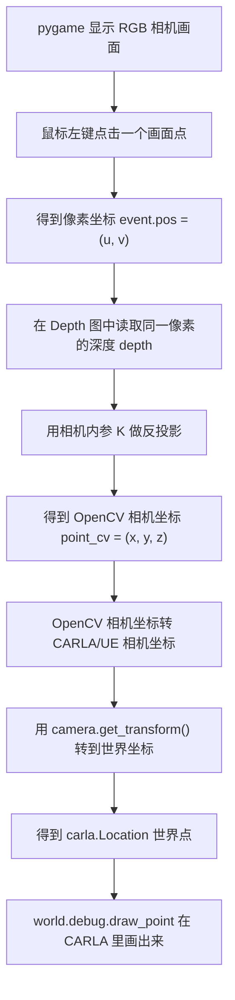
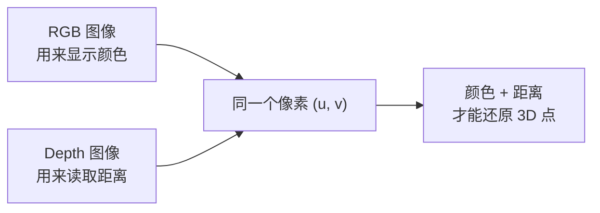
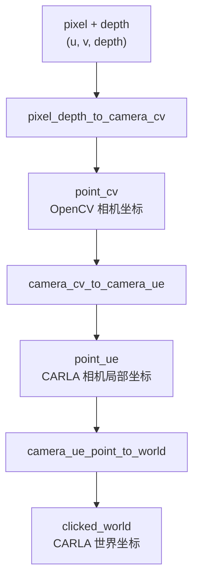
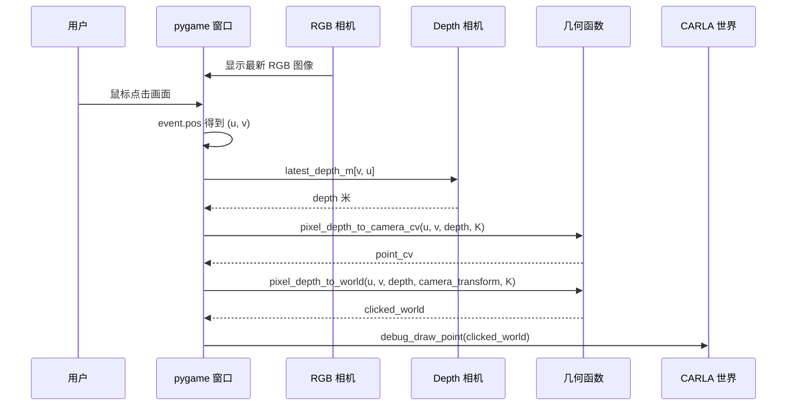

# 08 从 2D 像素点反投影到 3D 世界点：小白教学

配套代码：

- `08_pixel_depth_to_world.py`
- `common.py`

本节要理解的是一句话：

> 你在 pygame 图像上点了一个像素 `(u, v)`，Depth 相机告诉你这个像素对应的距离 `depth`，相机内参 `K` 把它还原成相机坐标系里的 3D 点，相机外参再把它搬到 CARLA 世界坐标系里。

先别急着背公式。你可以把它想成“从一张照片里的一个点，沿着相机视线倒着找回真实世界里的点”。

## 1. 先看总流程



这条链路在代码里对应下面几行：

```python
clicked_pixel = event.pos
u, v = clicked_pixel
depth = float(depth_camera.latest_depth_m[v, u])

point_cv = pixel_depth_to_camera_cv(u, v, depth, k)
clicked_world = pixel_depth_to_world(u, v, depth, rgb_camera.get_transform(), k)
debug_draw_point(world, clicked_world, text="pixel+depth")
```

注意这一行很关键：

```python
depth = float(depth_camera.latest_depth_m[v, u])
```

你点击得到的是 `(u, v)`，也就是 `(横坐标, 纵坐标)`；但 numpy 数组读取顺序是 `[行, 列]`，也就是 `[v, u]`。这是初学者最容易写反的地方。

## 2. pygame 画面上的 `(u, v)` 是什么

图像坐标系和我们平时数学课上的坐标系不一样。

```text
像素坐标系

(0, 0)  --------------------> u / x 方向
   |
   |
   |
   v
 v / y 方向
```

- 左上角是 `(0, 0)`
- 往右，`u` 变大
- 往下，`v` 变大
- 图像中心大约是 `(width / 2, height / 2)`

在本教程里，`08_pixel_depth_to_world.py` 使用一组本节自己的窗口尺寸。这样 pygame 是普通可移动窗口，不会顶满屏幕：

```python
PYGAME_WINDOW_WIDTH = 1280
PYGAME_WINDOW_HEIGHT = 720
```

所以图像中心大约是：

```text
cx = 1280 / 2 = 640
cy = 720 / 2 = 360
```

如果你点击画面中心附近，例如 `(640, 360)`，它大概代表“相机正前方”。如果你点击右边，例如 `(760, 360)`，它代表“相机前方偏右的一条视线”。如果点击下方，例如 `(640, 480)`，它代表“相机前方偏下的一条视线”。

## 3. Depth 图在这里提供了什么

RGB 图告诉你“这个点长什么样”，Depth 图告诉你“这个点离相机多远”。



代码里创建了两个相机：

```python
rgb_camera = CameraSensor(
    world, vehicle, "sensor.camera.rgb",
    width=PYGAME_WINDOW_WIDTH, height=PYGAME_WINDOW_HEIGHT,
)
depth_camera = CameraSensor(
    world, vehicle, "sensor.camera.depth",
    width=PYGAME_WINDOW_WIDTH, height=PYGAME_WINDOW_HEIGHT,
)
```

它们使用相同的默认分辨率、FOV 和安装位置，所以同一个像素 `(u, v)` 在 RGB 图和 Depth 图里可以认为是对齐的：

```text
RGB 图中的 (u, v)   -> 这个点看起来是什么颜色
Depth 图中的 (u, v) -> 这个点大约离相机多少米
```

Depth 相机原始图像不是直接给 float 米值，而是把深度编码进 BGRA 图像数据里。`common.py` 里的 `decode_depth_image_to_meters(image)` 会把它解码成：

```text
latest_depth_m.shape = (height, width)
latest_depth_m[v, u] = 该像素的深度，单位是米
```

## 4. 为什么只知道 `(u, v)` 还不够

只知道像素点，其实只知道“一条射线方向”，还不知道点在这条射线上的哪个位置。

```text
相机中心 O
   \
    \
     \  同一个像素方向上的射线
      \
       * 近处点？
        \
         * 中处点？
          \
           * 远处点？
```

如果没有深度，你只能知道“它在这条线上”。有了 depth，你才知道“它在线上大概走了多少米”。

所以这节课的输入一定是：

```text
像素坐标 (u, v) + 深度 depth
```

而不是只有 `(u, v)`。

## 5. 相机内参 K：像素和相机坐标之间的尺子

相机内参 `K` 描述的是相机内部的几何关系：

```text
K = | fx   0   cx |
    |  0  fy   cy |
    |  0   0    1 |
```

它有四个最重要的量：

- `fx`：水平方向焦距，单位是像素
- `fy`：垂直方向焦距，单位是像素
- `cx`：图像中心 x
- `cy`：图像中心 y

在代码中：

```python
k = build_camera_intrinsic_k(PYGAME_WINDOW_WIDTH, PYGAME_WINDOW_HEIGHT, CAMERA_FOV)
```

`build_camera_intrinsic_k()` 会根据图像宽高和 FOV 构造 `K`。你可以先这样理解：

```text
K 的作用：
  把“像素偏离图像中心多少”翻译成“相机前方空间里偏右/偏下多少”。
```

## 6. 针孔相机模型：从 3D 投到 2D

先看正向投影。假设一个点在 OpenCV 相机坐标系里是：

```text
point_cv = (x, y, z)
```

OpenCV 相机坐标系的方向是：

```text
x：向右
y：向下
z：向前
```

它投影到图像上：

```text
u = fx * x / z + cx
v = fy * y / z + cy
```

直觉解释：

- `x / z`：点越靠右，图像越靠右；点越远，同样的右偏移看起来越小
- `y / z`：点越靠下，图像越靠下；点越远，同样的下偏移看起来越小
- `+ cx, + cy`：把相机中心移动到图像中心

## 7. 反投影：从 2D 像素倒推 3D 相机点

这节课做的是反过来：

```text
已知：u, v, depth
求： x, y, z
```

代码里把 `depth` 当作相机前方的 `z` 使用：

```text
z = depth
```

然后把投影公式反解：

```text
x = (u - cx) / fx * z
y = (v - cy) / fy * z
z = depth
```

对应 `common.py`：

```python
def pixel_depth_to_camera_cv(u, v, depth_m, k):
    fx = k[0, 0]
    fy = k[1, 1]
    cx = k[0, 2]
    cy = k[1, 2]

    x = (u - cx) / fx * depth_m
    y = (v - cy) / fy * depth_m
    z = depth_m
    return np.array([x, y, z], dtype=float)
```

这一步得到的是 OpenCV 相机坐标：

```text
point_cv = [x, y, z]
```

也就是“这个点相对于相机：向右多少米、向下多少米、向前多少米”。

## 8. 用一个数字例子走一遍

假设：

```text
width = 1280
height = 720
FOV = 90 度
```

那么大约：

```text
fx = 640
fy = 640
cx = 640
cy = 360
```

你点击了：

```text
u = 760
v = 440
depth = 20 米
```

代入反投影公式：

```text
x = (760 - 640) / 640 * 20 = 3.75 米
y = (440 - 360) / 640 * 20 = 2.50 米
z = 20 米
```

所以：

```text
point_cv = (3.75, 2.50, 20.00)
```

翻译成人话：

```text
这个像素对应的 3D 点，
在相机前方约 20 米，
向右约 3.75 米，
向下约 2.50 米。
```

这就是“从 2D 像素 + depth 还原出相机坐标系 3D 点”的核心。

## 9. 为什么还要转换坐标系

现在得到的 `point_cv` 只是“相对于相机”的位置。可是 CARLA 世界里的 debug draw 需要的是世界坐标，例如：

```text
x = 55.3, y = 128.7, z = 0.8
```

所以还要继续做两步：


### 第一步：OpenCV 相机坐标 -> CARLA/UE 相机坐标

OpenCV 和 CARLA 的相机局部坐标轴命名不一样。

```text
OpenCV camera:
  x = 右
  y = 下
  z = 前

CARLA/UE camera:
  x = 前
  y = 右
  z = 上
```

所以需要换轴：

```text
x_ue = z_cv
y_ue = x_cv
z_ue = -y_cv
```

对应代码：

```python
def camera_cv_to_camera_ue(point_cv):
    return np.array([point_cv[2], point_cv[0], -point_cv[1]], dtype=float)
```

刚才的例子：

```text
point_cv = (2.08, 1.67, 20.00)

x_ue = 20.00
y_ue = 2.08
z_ue = -1.67

point_ue = (20.00, 2.08, -1.67)
```

翻译成人话：

```text
这个点在 CARLA 相机局部坐标里：
前方 20.00 米，
右侧 2.08 米，
上方 -1.67 米，也就是下方 1.67 米。
```

### 第二步：CARLA/UE 相机坐标 -> 世界坐标

相机坐标还只是“相对于当前相机”。但车在地图上移动，相机也跟着车移动和旋转。

因此需要相机当前的世界位姿：

```python
rgb_camera.get_transform()
```

这个 transform 里面包含：

```text
相机在世界里的位置 location
相机在世界里的旋转 rotation
```

`camera_ue_point_to_world()` 会拿到相机的 4x4 变换矩阵：

```python
camera_to_world = np.array(camera_transform.get_matrix())
world_point = np.dot(camera_to_world, point_h)
```

直觉上，它做了两件事：

```text
1. 先按相机朝向旋转这个局部点
2. 再把点平移到相机所在的世界位置
```

## 10. 完整函数 `pixel_depth_to_world`

现在再看这个函数，就很清楚了：

```python
def pixel_depth_to_world(u, v, depth_m, camera_transform, k):
    point_cv = pixel_depth_to_camera_cv(u, v, depth_m, k)
    point_ue = camera_cv_to_camera_ue(point_cv)
    return camera_ue_point_to_world(point_ue, camera_transform)
```

它就是三段式：



## 11. 代码运行时每一帧在做什么



你运行脚本后，点击路面点，会看到两处反馈：

- pygame 窗口里：点击位置出现红色圆圈
- CARLA UE 窗口里：反算出的 3D 世界点被 debug draw 标出来

如果两者看起来对得上，说明这条链路大体跑通了。

## 12. 把每个变量翻译成人话

| 变量 | 类型 | 人话解释 |
| --- | --- | --- |
| `clicked_pixel` | `(u, v)` | 你在 pygame 图像上点的位置 |
| `u` | float/int | 图像横坐标，越右越大 |
| `v` | float/int | 图像纵坐标，越下越大 |
| `depth` | float | 这个像素对应的深度，单位米 |
| `k` | 3x3 matrix | 相机内参，像素和相机空间之间的换算尺 |
| `point_cv` | numpy array | OpenCV 相机坐标，`x右 y下 z前` |
| `point_ue` | numpy array | CARLA 相机局部坐标，`x前 y右 z上` |
| `camera_transform` | carla.Transform | 相机当前在世界里的位置和姿态 |
| `clicked_world` | carla.Location | 反算出的 CARLA 世界坐标 |

## 13. 初学者最容易踩的坑

### 坑 1：把 `[v, u]` 写成 `[u, v]`

点击事件给的是：

```text
(u, v) = (横坐标, 纵坐标)
```

numpy 图像数组读取是：

```text
array[行, 列] = array[y, x] = array[v, u]
```

所以正确写法是：

```python
depth = float(depth_camera.latest_depth_m[v, u])
```

### 坑 2：RGB 相机和 Depth 相机必须对齐

这一课能直接读取同一个 `(u, v)`，是因为 RGB 和 Depth 相机：

- 分辨率相同
- FOV 相同
- 安装位置相同
- 朝向相同

如果以后你把两个相机装在不同位置，就不能再简单地拿同一个像素直接查 depth。

### 坑 3：相机坐标不是世界坐标

`point_cv` 或 `point_ue` 只是“相对于相机”的点。

只有经过：

```text
camera local -> world
```

之后，才可以拿去 CARLA 里 `debug_draw_point()`。

### 坑 4：这节课目前是异步读取 latest 数据

`CameraSensor.listen()` 是异步回调，脚本主循环读取的是最新收到的图像和深度。教学演示通常够用。

但如果你要做严肃实验，比如记录数据集、融合 IMU/GNSS、评估误差，应该使用 synchronous mode，让 RGB、Depth、车辆位姿按同一个 `frame` 对齐。

### 坑 5：depth 的定义要和公式匹配

本教程代码按针孔模型把 `depth` 当作相机前方的 `z` 使用：

```text
z = depth
```

这对理解反投影链路非常直观。以后如果你接入真实传感器或其他仿真器，要确认它给的是“沿相机前方的 z 深度”，还是“沿射线的欧氏距离”。定义不同，反投影公式会有细微差别。

## 14. 你可以这样边跑边验证

先启动 CARLA server：

```powershell
D:\HST_WORK\carla\WindowsNoEditor\CarlaUE4.exe -carla-rpc-port=2000
```

再运行 lesson：

```powershell
cd D:\HST_WORK\py_project\carla_test\carla_from_zero_to_ar_tutorial
C:\Users\cicii\miniconda3\envs\carla_test\python.exe 08_pixel_depth_to_world.py
```

建议观察顺序：

1. 点击画面中心附近的路面点，看 CARLA 里 debug 点是否在车前方。
2. 点击画面右侧路面点，看 debug 点是否偏向车辆右前方。
3. 点击画面下方近处路面点，看 depth 是否比远处小。
4. 看终端打印的 `camera_cv=(x,y,z)`，理解 `x/y/z` 的方向。
5. 移动车辆后再点击，理解为什么同一个像素会映射到新的世界位置。

## 15. 本节的核心心法

你可以把整条链路背成四句话：

```text
1. 鼠标点击给我图像坐标 (u, v)。
2. Depth 图告诉我这个像素有多深 depth。
3. 相机内参 K 把 (u, v, depth) 还原成相机坐标。
4. 相机外参 transform 把相机坐标搬到 CARLA 世界坐标。
```

再压缩成一句：

```text
像素 + 深度 + 内参 + 外参 = 世界坐标
```

这就是 2D 图像点映射到 3D 世界点的核心原理。

## 16. 小练习

### 练习 1：判断方向

如果你点击图像中心右侧，`u > cx`，那么 `x_cv` 是正还是负？

答案：正。因为 OpenCV 相机坐标里 `x` 向右。

### 练习 2：判断上下

如果你点击图像中心下方，`v > cy`，那么 `y_cv` 是正还是负？

答案：正。因为 OpenCV 相机坐标里 `y` 向下。

### 练习 3：看换轴

如果：

```text
point_cv = (2, 1, 10)
```

那么：

```text
point_ue = (10, 2, -1)
```

解释：

- OpenCV 的前方 `z=10` 变成 CARLA 的前方 `x=10`
- OpenCV 的右方 `x=2` 变成 CARLA 的右方 `y=2`
- OpenCV 的下方 `y=1` 变成 CARLA 的上方 `z=-1`

### 练习 4：看代码找链路

在 `08_pixel_depth_to_world.py` 里找到下面四件事：

```text
1. 哪里创建了 K？
2. 哪里读取了 clicked_pixel？
3. 哪里从 depth 图读取 depth？
4. 哪里把 pixel + depth 转成 clicked_world？
```

对应位置：

```text
1. k = build_camera_intrinsic_k(...)
2. clicked_pixel = event.pos
3. depth = float(depth_camera.latest_depth_m[v, u])
4. clicked_world = pixel_depth_to_world(...)
```

如果这四行能串起来，这节课的主线你就已经抓住了。
