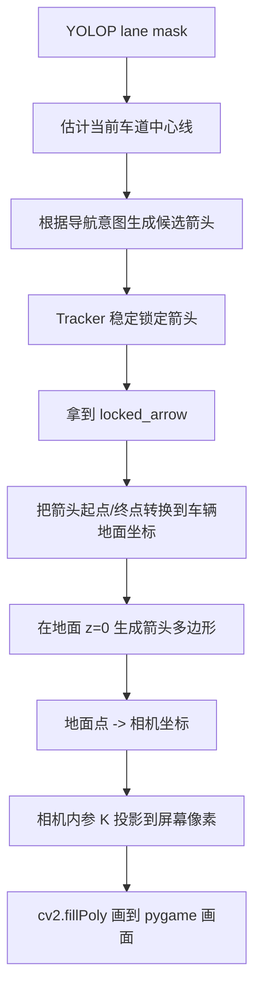
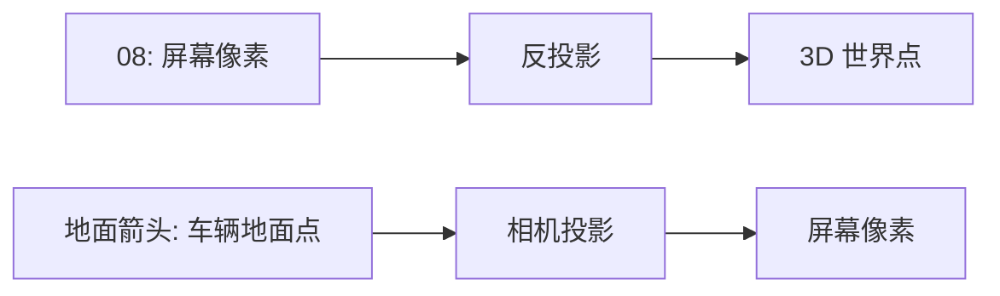

# CARLA YOLOP 地面投影箭头教学

这份文档讲的是 [carla_yolop_ground_arrow_demo.py](./carla_yolop_ground_arrow_demo.py) 里新增的“贴地 AR 箭头”是怎么实现的。

先记住一句话：

> 用户最后看到的永远是 2D 屏幕，但我们可以先在车辆前方的虚拟地面上生成一个 3D/地面坐标箭头，再把它投影成屏幕像素。这样 2D 图像里的箭头就会自然拥有近大远小的透视效果。

预览效果：


## 1. 新旧箭头差别

旧版箭头是“屏幕 2D 箭头”：

```text
已知屏幕起点像素 start=(u1, v1)
已知屏幕终点像素 target=(u2, v2)
直接用 cv2.line / fillConvexPoly 在屏幕上画
```

它的问题是：线宽、箭头头部大小基本是屏幕像素单位。虽然起点和终点有地面含义，但箭头本体不是贴在地面上的真实形状。

新版箭头是“地面投影箭头”：

```text
先在车辆坐标系的地面 z=0 上生成一个扁平箭头
再把地面箭头的每个点投影到屏幕像素
最后用 cv2.fillPoly 填充投影后的多边形
```

这样近处点离相机近，投影后自然更宽；远处点离相机远，投影后自然更窄。

## 2. 总体流程



这次主要改的是后半段，也就是：

```text
locked_arrow
-> 地面箭头多边形
-> 屏幕像素多边形
-> 绘制
```

YOLOP 检测、导航意图、稳定锁定这些逻辑基本沿用上一版。

## 3. 坐标系先讲清楚

### 3.1 屏幕坐标系

屏幕坐标就是 pygame/OpenCV 图像里的像素坐标：

```text
u / x：向右增加
v / y：向下增加
原点：左上角
```

比如：

```text
(0, 0)       是左上角
(640, 360)   大概是 1280x720 画面的中心
```

### 3.2 车辆坐标系

CARLA/UE 车辆附近可以理解成：

```text
x：车辆前方
y：车辆右侧
z：向上
```

所以地面就是：

```text
z = 0
```

如果我们写一个地面点：

```text
(forward_m, right_m, 0)
```

含义就是：

```text
车前 forward_m 米
车右 right_m 米
贴在地面上
```

比如直行箭头从车前 5m 到车前 10m：

```text
start_ground  = (5.0,  -0.35)
target_ground = (10.0, -0.35)
```

这里省略了 z，因为默认 z=0。

### 3.3 OpenCV 相机坐标系

相机投影公式通常按 OpenCV 相机坐标理解：

```text
X：相机右侧
Y：相机下方
Z：相机前方
```

投影公式是：

```text
u = fx * X / Z + cx
v = fy * Y / Z + cy
```

这里：

```text
fx, fy：焦距，来自相机内参 K
cx, cy：主点，通常接近画面中心
Z：深度，点在相机前方多远
```

只要 `Z` 越小，也就是点越近，`X/Z` 和 `Y/Z` 的影响就越大，于是屏幕上看起来就越大。

这就是近大远小的来源。

## 4. 第一步：拿到 locked_arrow

前面的导航逻辑会生成一个稳定箭头：

```python
LockedNavArrow(
    nav_mode="straight / left / right",
    start=(屏幕起点像素),
    target=(屏幕终点像素),
    confidence=...,
    locked_at=...,
    expires_at=...
)
```

它来自 tracker：

```text
YOLOP 候选点
-> 连续几次稳定
-> 锁定 3 秒
```

这样箭头不会每帧跟着模型输出抖动。

新版绘制入口在：

```text
draw_locked_arrow(...)
```

对应代码位置：

```text
carla_yolop_ground_arrow_demo.py:933
```

这里会判断：

```python
if args.arrow_projection == "ground":
    draw_ground_projected_arrow(...)
else:
    draw_glow_line(...)
```

也就是说，你可以随时用参数切回旧版：

```powershell
--arrow-projection screen
```

## 5. 第二步：把箭头起点/终点变成地面坐标

关键函数：

```text
ground_segment_from_locked_arrow(...)
```

对应代码位置：

```text
carla_yolop_ground_arrow_demo.py:653
```

它做的事是：

```text
locked_arrow
-> start_ground
-> target_ground
```

### 5.1 直行箭头

直行箭头比较简单，因为我们本来就知道想画：

```text
车前 5m -> 车前 10m
```

所以直接生成地面坐标：

```python
start_ground = [args.arrow_start_meters, straight_right_meters(args)]
target_ground = [args.straight_target_forward_meters, straight_right_meters(args)]
```

默认就是：

```text
5m -> 10m
```

### 5.2 左转/右转箭头

左转和右转的目标点来自 YOLOP 车道线，它一开始是屏幕像素：

```text
locked_arrow.start  = 屏幕像素
locked_arrow.target = 屏幕像素
```

为了生成贴地箭头，我们需要把这两个屏幕像素反推到车辆地面坐标：

```python
start_ground = pixel_to_vehicle_ground(locked_arrow.start, args)
target_ground = pixel_to_vehicle_ground(locked_arrow.target, args)
```

这个逻辑和 08 教程是同一类思想：

```text
屏幕像素
-> 相机射线
-> 和地面 z=0 求交
-> 得到车辆坐标系下的地面点
```

如果反推失败，新脚本会退回旧版屏幕箭头，避免直接不显示。

## 6. 第三步：在地面上生成箭头多边形

关键函数：

```text
ground_arrow_polygon(...)
```

对应代码位置：

```text
carla_yolop_ground_arrow_demo.py:675
```

这里不需要你提供 3D 模型，因为箭头本质上可以是一个贴地的扁平多边形。

假设我们已经有：

```text
start_ground
target_ground
```

先求方向：

```python
vec = target_ground - start_ground
direction = vec / length
```

再求一个垂直方向，也就是箭头左右展开的方向：

```python
normal = [-direction_y, direction_x]
```

你可以把它想象成：

```text
direction：箭头往哪儿指
normal：箭头左右有多宽
```

然后设置真实世界尺寸：

```text
body_width：箭身宽度，比如 0.62m
head_width：箭头头部宽度，比如 1.35m
head_length：箭头头部长度，比如 1.35m
```

最后生成 7 个地面点：

```text
tail_left
body_left
head_left
tip
head_right
body_right
tail_right
```

示意图：

```text
              tip
             /   \
    head_left     head_right
       |             |
    body_left     body_right
       |             |
    tail_left     tail_right
```

注意：这些点仍然是车辆地面坐标，不是屏幕像素。

它们类似：

```text
(5.0, -0.31)
(8.65, -0.31)
(8.65, -0.675)
(10.0, 0.0)
(8.65, 0.675)
(8.65, 0.31)
(5.0, 0.31)
```

每个点都默认在：

```text
z = 0
```

所以它们是贴地的。

## 7. 第四步：把地面点投影到屏幕

关键函数：

```text
project_vehicle_ground_to_pixel(...)
```

对应代码位置：

```text
carla_yolop_ground_arrow_demo.py:222
```

它做的是：

```text
车辆地面点
-> 相机坐标
-> OpenCV 相机坐标
-> 屏幕像素
```

代码核心：

```python
point_vehicle = [forward_m, right_m, ground_z, 1.0]
point_ue = vehicle_to_camera @ point_vehicle
point_cv = [point_ue[1], -point_ue[2], point_ue[0]]
projected = K @ point_cv
u = projected[0] / projected[2]
v = projected[1] / projected[2]
```

这里分三层理解。

### 7.1 车辆坐标 -> 相机坐标

`camera_mount_transform` 是相机相对车辆的外参。

要把车辆坐标里的点转到相机坐标，需要用它的逆矩阵：

```python
vehicle_to_camera = camera_mount.get_inverse_matrix()
```

然后：

```python
point_ue = vehicle_to_camera @ point_vehicle
```

此时得到的是 CARLA/UE 风格的相机坐标。

### 7.2 UE 相机坐标 -> OpenCV 相机坐标

CARLA/UE 相机坐标可以理解成：

```text
x：前方
y：右方
z：上方
```

OpenCV 相机坐标是：

```text
X：右方
Y：下方
Z：前方
```

所以换轴：

```python
point_cv = [point_ue[1], -point_ue[2], point_ue[0]]
```

意思是：

```text
OpenCV X = UE y
OpenCV Y = -UE z
OpenCV Z = UE x
```

### 7.3 相机坐标 -> 屏幕像素

用相机内参矩阵 K：

```text
K = [ fx  0  cx
      0  fy  cy
      0   0   1 ]
```

投影：

```python
projected = K @ point_cv
u = projected[0] / projected[2]
v = projected[1] / projected[2]
```

这就是经典针孔相机模型。

因为远处点的 `Z` 更大，所以它投影到屏幕后自然更小。

## 8. 第五步：把投影后的多边形画出来

关键函数：

```text
project_ground_polygon(...)
draw_ground_polygon_layer(...)
```

对应代码位置：

```text
carla_yolop_ground_arrow_demo.py:251
```

流程：

```text
地面多边形 7 个点
-> 每个点投影成屏幕像素
-> 得到屏幕多边形
-> cv2.fillPoly 填充
```

代码思路：

```python
projected = project_ground_polygon(points, args, width, height)
cv2.fillPoly(layer, [projected], color)
blend_overlay(bgr, layer, alpha)
```

为什么用半透明？

因为真实 AR 导航通常不会完全挡住路面。半透明之后，你还能看到车道线、路面纹理和障碍物。

## 9. 第六步：分层绘制，让箭头更像 AR

关键函数：

```text
draw_ground_projected_arrow(...)
```

对应代码位置：

```text
carla_yolop_ground_arrow_demo.py:757
```

它不是只画一层，而是画几层：

```text
1. glow_points：更宽的外发光层
2. main_points：主体箭头面片
3. inner_points：内部白色高光
4. outline：边缘线
5. flow_chevrons：流动的小箭头动效
```

这样看起来会比单纯一个实心多边形更像 AR 指示。

参数对应：

```powershell
--ground-arrow-body-width-m 0.62
--ground-arrow-head-width-m 1.35
--ground-arrow-head-length-m 1.35
--ground-arrow-alpha 0.48
--ground-arrow-glow-alpha 0.18
--ground-arrow-inner-alpha 0.12
--ground-arrow-edge-alpha 0.32
```

这些都是“真实地面尺寸”或“透明度”，不是屏幕像素。

这点很重要：

```text
body width = 0.62m
```

不是说屏幕上 0.62 像素，而是说地面上这个箭身真实宽 0.62 米。投影后屏幕宽度会自动变化。

## 10. 为什么近大远小会自然出现

假设地面上箭身宽度一直是：

```text
0.62m
```

近处横向半宽是：

```text
right = ±0.31m
```

远处也是：

```text
right = ±0.31m
```

但相机投影时：

```text
u = fx * X / Z + cx
```

近处点：

```text
Z 小
X/Z 大
屏幕展开更大
```

远处点：

```text
Z 大
X/Z 小
屏幕展开更小
```

所以虽然地面宽度相同，屏幕上会自然变成：

```text
近处宽
远处窄
```

这就是贴地透视箭头和旧版 2D 箭头最大的区别。

## 11. 和 08 教程的关系

08 的方向是：

```text
屏幕像素 + 深度
-> 反投影
-> 3D 世界点
```

这次地面箭头的方向是：

```text
3D/车辆地面点
-> 投影
-> 屏幕像素
```

它们刚好是两个方向：



你之前理解的 OpenCV 相机坐标、UE 相机坐标、相机内参，在这里全部用上了。

## 12. 实车迁移时要注意什么

在 CARLA 里，我们知道：

```text
相机相对车辆的位置和姿态
相机内参 K
地面平面 z=0
```

所以可以比较顺利地做：

```text
车辆地面点 -> 屏幕像素
```

实车里也要准备类似信息：

```text
1. 相机内参 K
2. 相机相对车体的外参
3. 车体坐标系定义
4. 地面平面假设，或者用深度/IMU估计地面
```

如果这些有误，箭头会出现：

```text
漂浮
陷进地面
偏左偏右
透视不对
```

所以实车版最关键的是相机标定和外参标定。

## 13. 推荐你读代码的顺序

先不要从 `main()` 开始读，会绕。

建议这样读：

1. `draw_locked_arrow(...)`

```text
carla_yolop_ground_arrow_demo.py:933
```

看它怎么决定使用 `ground` 还是 `screen`。

2. `draw_ground_projected_arrow(...)`

```text
carla_yolop_ground_arrow_demo.py:757
```

看它如何分层画 glow、main、inner、edge、flow。

3. `ground_segment_from_locked_arrow(...)`

```text
carla_yolop_ground_arrow_demo.py:653
```

看它如何把 locked arrow 转成地面起终点。

4. `ground_arrow_polygon(...)`

```text
carla_yolop_ground_arrow_demo.py:675
```

看它如何用方向向量和法向量生成 7 个地面点。

5. `project_vehicle_ground_to_pixel(...)`

```text
carla_yolop_ground_arrow_demo.py:222
```

看它如何把车辆地面点投影到屏幕。

## 14. 常用调参建议

如果你觉得箭头太宽：

```powershell
--ground-arrow-body-width-m 0.45
--ground-arrow-head-width-m 1.05
```

如果你觉得箭头太淡：

```powershell
--ground-arrow-alpha 0.60
--ground-arrow-glow-alpha 0.24
```

如果你觉得箭头太挡路：

```powershell
--ground-arrow-alpha 0.35
--ground-arrow-inner-alpha 0.08
```

如果你想对比旧版：

```powershell
--arrow-projection screen
```

如果你想看默认地面投影版：

```powershell
C:\Users\cicii\miniconda3\envs\carla_test\python.exe .\lane_detection_demos\carla_yolop_ground_arrow_demo.py
```

## 15. 一句话总结

旧版是在屏幕上画箭头：

```text
2D start pixel -> 2D target pixel -> cv2 画线
```

新版是在地面上放箭头，再让相机看到它：

```text
车辆地面箭头点 -> 相机外参 -> OpenCV 相机坐标 -> 相机内参 K -> 屏幕像素 -> cv2 画多边形
```

所以它看起来更像“贴在道路上的 AR 导航箭头”。

